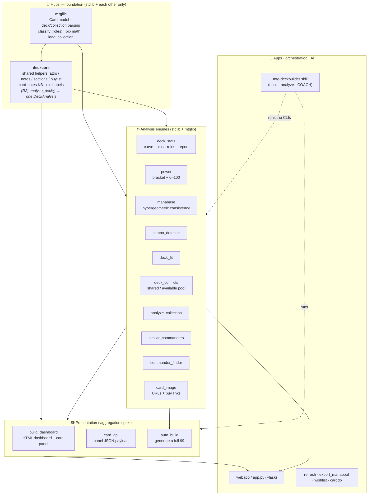

# Codemap — MTG Deckbuilder architecture

How the codebase fits together, and the **hub-and-spoke** model it's being refactored
toward. Companion to [research-roadmap.md](research-roadmap.md) (vision) and
[spec-interactive-analytics-ai.md](spec-interactive-analytics-ai.md) (feature tracker).

## Shape in one line

Two **hubs** (`mtglib` = data, `deckcore` = analysis) feed a ring of stdlib **analysis
engines**, which feed **presentation spokes** (`build_dashboard`, `card_api`,
`auto_build`), consumed by the **Flask web app**, the **CLIs**, and the **coaching skill**.

## Dependency map

**Rule of the model:** dependencies point *inward/downward* — engines and spokes depend on
the hubs, never the reverse; spokes don't import each other. After **R1** no analysis
module imports the `build_dashboard` renderer (the old circular imports are gone).

## Module reference (`scripts/`, stdlib-only Python 3)

| Module | Role | Depends on |
|---|---|---|
| **mtglib** | Data hub: `Card`, parsing, `classify`, pip math, `load_collection` (+ attrs/additions overlay) | — |
| **deckcore** | Analysis hub: shared file loaders, card-notes KB, role labels; *(R2)* `analyze_deck()` | mtglib |
| deck_stats | curve, colored-pip demand vs sources, role counts, ownership | mtglib |
| power | WotC bracket (1–5, estimated) + 0–100 power score | mtglib, deck_stats, combo_detector, deckcore |
| manabase | hypergeometric consistency: keepable %, source adequacy vs Karsten, risky-on-curve | mtglib |
| combo_detector | infinite / 2-card combos present or one-away (`combos.csv`) | mtglib |
| deck_fit | per-card fit score (library; no CLI) | mtglib |
| deck_conflicts | shared-across-decks + `--available` buildable pool | mtglib |
| analyze_collection | "what can I build?" pool stats by color/type/tribe | mtglib |
| similar_commanders / commander_finder | alternate commanders / "build next" ranking | mtglib, deckcore/simc |
| card_image | Scryfall image URLs + `purchase_links` (TCGplayer/ManaPool/Card Kingdom) | mtglib |
| **build_dashboard** | Spoke: deck → self-contained HTML dashboard + card panel | mtglib, deckcore, deck_stats, power, manabase, combo_detector, deck_fit, simc, card_image, deck_conflicts |
| **card_api** | Spoke: grounded per-card JSON for the site-wide panel | mtglib, deckcore, card_image, combo_detector |
| **auto_build** | Spoke: assemble a full 99 from the owned pool | mtglib, deck_fit, deck_conflicts, simc, power, deck_stats, manabase, combo_detector, card_image |
| carddb | enrich the collection (colors/types/MV/id) → `collection_attrs.csv` | mtglib |
| wishlist / staples_crossref / export_manapool / refresh | buy list / staple diff / exports / regenerate-all | mtglib (+ deck_conflicts / wishlist) |

## Web app (`webapp/`)

`app.py` (Flask) is the primary spoke consumer: routes call the engines/spokes and render
Jinja templates. Shared front-end: `static/cardpanel.{css,js}` (the bottom-sheet card panel,
site-wide via `data-card`), `static/cardgrid.js` + `static/collection.js` (batch CDN image
loading). Key routes: `/` decks leaderboard · `/deck/<stem>` dashboard · `/build-next` (+
`/…/deck` auto-build, "build any commander") · `/collection` (searchable grid) · `/wishlist`
· `/shared` · `/api/card/<name>` · `/deck/<stem>/assess.txt` (coaching packet).

## The coaching skill (`.claude/skills/mtg-deckbuilder/`)

`SKILL.md` (persona + build/analyze/**coach** workflows) + `references/` (grounding-rules,
deckbuilding-principles, rules-reference, tooling-and-data, **coaching**). It *invokes the
CLIs* to stay grounded; it doesn't reimplement them. Runs in Claude Code (no app-side API).

## Data (`data/`)

`collection/` (name-only `collection_snapshot.txt` committed; private `collection.csv` +
derived `collection_attrs.csv` gitignored) · `decks/*.txt` (+ optional `.attrs/.notes/.buylist`
companions) · `reference/` (game_changers, tutors, combos, card_notes, role_staples,
commanders, archetype_support).

## Refactor status (hub-and-spoke)

- **R1 ✅ done** — extract shared helpers into `deckcore`; break the `build_dashboard`
  circular imports. Behavior-identical (UAT harness byte-for-byte).
- **R2 (next)** — add `deckcore.analyze_deck() → DeckAnalysis` so the ~5 places that
  re-assemble the deck pipeline (build_dashboard.generate, auto_build, power.build_for_deck,
  manabase CLI, webapp `_assess_packet`) call one function.
- **R3 (optional)** — split `build_dashboard`'s section renderers if still unwieldy after R2.

## Parked ideas / backlog

- **Enrichment via Scryfall `/cards/collection` API** (instead of `carddb.py`'s ~40 MB bulk
  download): resolve exact printings by the export's `set`+`collector_number` → correct
  attributes *and* the right-art Scryfall ID; ~24 requests, stdlib-only. Two packagings —
  **A.** `carddb --api` (keep bulk as offline fallback), **B.** auto-enrich on collection
  upload (zero manual step). Empirically validated (set+number returns full attrs). *Deferred.*
- EDHREC (`pyedhrec`) staple/inclusion chip + buy-to-complete · Commander Spellbook combos ·
  Phase 4 generated card strategies. See the feature tracker.
