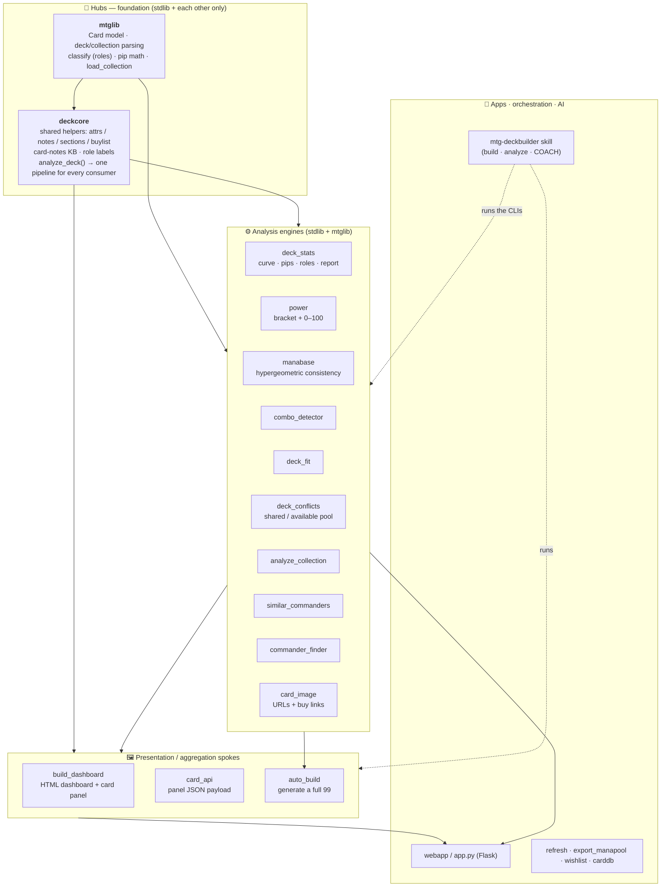

# Codemap — MTG Deckbuilder architecture

How the codebase fits together, and the **hub-and-spoke** model it's being refactored
toward. Companion to [research-roadmap.md](research-roadmap.md) (vision) and
[spec-interactive-analytics-ai.md](spec-interactive-analytics-ai.md) (feature tracker).

## Shape in one line

Two **hubs** (`mtglib` = data, `deckcore` = analysis) feed a ring of stdlib **analysis
engines**, which feed **presentation spokes** (`build_dashboard`, `card_api`,
`auto_build`), consumed by the **Flask web app**, the **CLIs**, and the **coaching skill**.

## Dependency map


```mermaid
flowchart TB
  subgraph HUBS["🎯 Hubs — foundation (stdlib + each other only)"]
    mtglib["<b>mtglib</b><br/>Card model · deck/collection parsing<br/>classify (roles) · pip math · load_collection"]
    deckcore["<b>deckcore</b><br/>shared helpers: attrs / notes / sections / buylist<br/>card-notes KB · role labels<br/>analyze_deck() → one pipeline for every consumer"]
  end

  subgraph ENGINES["⚙️ Analysis engines (stdlib + mtglib)"]
    deck_stats["deck_stats<br/>curve · pips · roles · report"]
    power["power<br/>bracket + 0–100"]
    manabase["manabase<br/>hypergeometric consistency"]
    combo["combo_detector"]
    deck_fit["deck_fit"]
    conflicts["deck_conflicts<br/>shared / available pool"]
    analyzec["analyze_collection"]
    simc["similar_commanders"]
    cfind["commander_finder"]
    cimg["card_image<br/>URLs + buy links"]
  end

  subgraph SPOKES["🖼️ Presentation / aggregation spokes"]
    dashboard["build_dashboard<br/>HTML dashboard + card panel"]
    cardapi["card_api<br/>panel JSON payload"]
    autobuild["auto_build<br/>generate a full 99"]
  end

  subgraph APPS["🚀 Apps · orchestration · AI"]
    webapp["webapp / app.py (Flask)"]
    refresh["refresh · export_manapool · wishlist · carddb"]
    skill["mtg-deckbuilder skill<br/>(build · analyze · COACH)"]
  end

  mtglib --> deckcore
  mtglib --> ENGINES
  deckcore --> ENGINES
  deckcore --> SPOKES
  ENGINES --> SPOKES
  ENGINES --> autobuild
  SPOKES --> webapp
  ENGINES --> webapp
  skill -. "runs the CLIs" .-> ENGINES
  skill -. "runs" .-> SPOKES
```

**Rule of the model:** dependencies point *inward/downward* — engines and spokes depend on
the hubs, never the reverse; spokes don't import each other. After **R1** no analysis
module imports the `build_dashboard` renderer (the old circular imports are gone).

## Module reference (`scripts/`, stdlib-only Python 3)

| Module | Role | Depends on |
|---|---|---|
| **mtglib** | Data hub: `Card`, parsing, `classify`, pip math, `load_collection` (+ attrs/additions overlay) | — |
| **deckcore** | Analysis hub: shared file loaders, card-notes KB, role labels; *(R2)* `analyze_deck()` | mtglib |
| deck_stats | curve, colored-pip demand vs sources, role counts, ownership | mtglib |
| power | WotC bracket (1–5, estimated) + 0–100 power score | mtglib, deck_stats, combo_detector, deckcore |
| manabase | hypergeometric consistency: keepable %, source adequacy vs Karsten, risky-on-curve | mtglib |
| combo_detector | infinite / 2-card combos present or one-away (`combos.csv`) | mtglib |
| deck_fit | per-card fit score (library; no CLI) | mtglib |
| deck_conflicts | shared-across-decks + `--available` buildable pool | mtglib |
| analyze_collection | "what can I build?" pool stats by color/type/tribe | mtglib |
| similar_commanders / commander_finder | alternate commanders / "build next" ranking | mtglib, deckcore/simc |
| card_image | Scryfall image URLs + `purchase_links` (TCGplayer/ManaPool/Card Kingdom) | mtglib |
| **build_dashboard** | Spoke: deck → self-contained HTML dashboard + card panel | mtglib, deckcore, deck_stats, power, manabase, combo_detector, deck_fit, simc, card_image, deck_conflicts |
| **card_api** | Spoke: grounded per-card JSON for the site-wide panel | mtglib, deckcore, card_image, combo_detector |
| **auto_build** | Spoke: assemble a full 99 from the owned pool | mtglib, deck_fit, deck_conflicts, simc, power, deck_stats, manabase, combo_detector, card_image |
| carddb | enrich the collection (colors/types/MV/**subtypes**/exact-printing id) → `collection_attrs.csv`; **default: Scryfall `/cards/collection` API** (no download), `--bulk`/`--download-bulk` for offline. Subtypes power tribal detection (deck_fit / auto_build). | mtglib |
| edhrec | EDHREC community staples for a commander vs your collection (inclusion% → own=add / missing=buy) + `inclusion_map()`, the **field signal** behind `deck_fit`; disk-cached, degrades gracefully | mtglib |
| **optimize** | Tune an EXISTING deck toward what the field plays: swaps low-value cards for owned+free high-inclusion ones, upgrades weak lands, repairs basics, keeps 100 cards + role balance. `--all --apply` | mtglib, deckcore, deck_fit, deck_conflicts, power |
| spellbook | Commander Spellbook combos present / one-away in a deck (full CSB DB, beyond `combos.csv`); disk-cached, degrades gracefully | mtglib |
| wishlist / staples_crossref / export_manapool / refresh | buy list / staple diff / exports / regenerate-all | mtglib (+ deck_conflicts / wishlist) |

## Web app (`webapp/`)

`app.py` (Flask) is the primary spoke consumer: routes call the engines/spokes and render
Jinja templates. Shared front-end: `static/cardpanel.{css,js}` (the bottom-sheet card panel,
site-wide via `data-card`), `static/cardgrid.js` + `static/collection.js` (batch CDN image
loading — see **[card-images.md](card-images.md)** for the retrieval rules). The **saved-deck dashboard is editable** (`generate(..., editable=True)`): the card panel
gets Remove / Replace (from the alternatives or an owned-card search), `POST /deck/<stem>/card`
rewrites the deck `.txt` in place, and shared-across-decks status shows in the panel. CLI-rendered
dashboards keep `editable=False`. Key routes: `/` decks leaderboard · `/deck/<stem>` dashboard
· `/deck/<stem>/card` (remove/replace) · `/api/collection/search` (owned autocomplete) · `/build-next` (+
`/…/deck` auto-build, "build any commander") · `/collection` (searchable grid) · `/wishlist`
· `/shared` · `/api/card/<name>` · `/deck/<stem>/assess.txt` (coaching packet).

## The coaching skill (`.claude/skills/mtg-deckbuilder/`)

`SKILL.md` (persona + build/analyze/**coach** workflows) + `references/` (grounding-rules,
deckbuilding-principles, rules-reference, tooling-and-data, **coaching**). It *invokes the
CLIs* to stay grounded; it doesn't reimplement them. Runs in Claude Code (no app-side API).

## Data (`data/`)

`collection/` (name-only `collection_snapshot.txt` committed; private `collection.csv` +
derived `collection_attrs.csv` gitignored) · `decks/*.txt` (+ optional `.attrs/.notes/.buylist`
companions) · `reference/` (game_changers, tutors, combos, card_notes, role_staples,
commanders, archetype_support).

## Keeping decks optimized (automated at four points)

| When | What runs | Where |
|---|---|---|
| **A new deck is saved** ("Save to my decks") | optimize runs automatically | `webapp` `build_deck_save` |
| **On demand** | ⚡ Optimize button per deck | `POST /deck/<stem>/optimize` |
| **After buying cards** | `refresh.py --optimize` (then rebuilds dashboards) | CLI |
| **Any Claude-driven build** | workflow step 5 in `SKILL.md` | the skill |

**Deliberately NOT automatic: manual edits.** The card panel's Remove/Replace and the deck
editor save your choice as-is — the optimizer never second-guesses a deliberate swap. Use
the ⚡ button when you *want* a tune-up. It's idempotent: an already-tuned deck is untouched.

```bash
python3 scripts/optimize.py --all --collection data/collection/collection.csv          # dry run
python3 scripts/optimize.py --all --collection data/collection/collection.csv --apply  # write
python3 scripts/refresh.py  --optimize --collection data/collection/collection.csv     # tune + rebuild
```

**The signal:** `deck_fit` scores cards partly by **EDHREC inclusion % for that specific
commander** (`edhrec.inclusion_map`). Without it the scorer only saw generic quality, so a
vanilla 1-drop outranked a 95%-played auto-include on curve alone — that's why the first
auto-built decks scored 12–24% against the field while hand-built ones scored 56–80%.

**Availability tiers.** Incoming cards rank **free** (you own a spare) > **shared** (owned
but committed to another deck) > **buy** (not owned, ≥55% inclusion). Sharing and buying are
**on by default** — two decks in one archetype legitimately want the same cards, and you
decide which gets the physical copy when you sleeve. Unowned picks are badged **BUY** in the
dashboard decklist (they're already `missing` to `deck_stats`). Use `--owned-only` for a list
buildable from spare copies today, or `--no-buys` to stay fully owned.

**Pool report.** Every run prints how the commander's top-25 splits into in-deck / free /
committed-elsewhere / not-owned, naming the decks holding contested copies — so a deck that
*can't* improve reads as "pool exhausted", not "badly built". `write_buylist()` turns the
unowned gaps into `<deck>.buylist.csv` (never overwriting a hand-written one).

**Guardrails** (each exists because a naive pass got it wrong): a swap needs a ≥25-point
inclusion gain; a card is valued at `max(field %, (fit−60)×2)` so premium-but-unpopular
cards survive; the commander, basics, `card_notes.csv` entries and anything named in the
deck's `.notes.md` are never cut; role counts must stay in template range; lands only swap
for lands; only cards with a **free** copy (not committed to another deck) can come in; and
with no field data the manabase is left alone entirely. Validate with EDHREC top-25 overlap
before/after — see `docs/handoff.md`.

## Tests (`tests/`, pytest)

```bash
pip install -r requirements-dev.txt && pytest
```

Offline and hermetic — every deck/collection a test touches is written into pytest's
`tmp_path`, so the suite never reads or writes the player's real `data/`. Coverage is aimed
at the code that can *destroy data or lie*: `test_deck_edit.py` (the web app rewriting deck
files in place — quantity/section preservation, no-op safety, comment lines, first-match-only),
`test_mtglib.py` (parsing / `_norm` / classification), `test_manabase.py` (hypergeometric
values + monotonicity), `test_auto_build.py` (exactly 100 cards, color legality, singleton,
honest shortfall, the `scan(skip=)` self-exclusion regression), and `test_dashboard.py`
(self-contained HTML, card panel present, editable-only-in-app, batch image loader) — which
doubles as the safety net for refactoring `build_dashboard`. CI: `.github/workflows/tests.yml`
runs pytest on 3.11/3.13 and re-checks that `scripts/` still imports with **no third-party
packages installed**.

## Refactor status (hub-and-spoke)

- **R1 ✅ done** — extract shared helpers into `deckcore`; break the `build_dashboard`
  circular imports. Behavior-identical (UAT harness byte-for-byte).
- **R2 ✅ done** — `deckcore.analyze_deck()` / `analyze_cards()`; `build_dashboard.generate`,
  the webapp assess packet, and `auto_build` now call one pipeline (`power.build_for_deck` +
  the `manabase` CLI stay as the low-level primitives). Behavior-identical (UAT byte-for-byte).
- **R3 ✅ done** — the dashboard's front-end assets moved out of the Python into
  **`scripts/assets/`**: `card_panel.html` (panel markup + its JS), `card_panel.css`
  (real CSS; `__DISPLAY__/__HEAD__/__MONO__` are swapped for the theme's fonts), and
  `card_images.html` (the batch image loader). `_asset()` reads + caches them and they're
  **inlined at render time**, so a generated dashboard is still one self-contained file.
  `build_dashboard.py` 1,411 → 1,018 lines; the 285-line `card_modal_block` string is gone,
  and the panel's JS/CSS are now editable (and lintable) without Python string-escaping.
  Verified **byte-identical** across all 6 decks × editable/non-editable (12/12).

## Shipped from the backlog

- ✅ **Enrichment via Scryfall `/cards/collection` API** — now `carddb.py`'s **default**
  (no ~40 MB download). Resolves each owned card by exact printing (`set`+`collector_number`,
  or a Scryfall id) with a name fallback; ~1 request per 75 cards, stdlib-only; bulk kept as
  the `--bulk`/`--download-bulk` offline path. Verified 2040/2040 on the real collection.
- ✅ **Auto-enrich on collection upload** — `/collection/upload` saves to the private,
  gitignored `collection.csv` (never the tracked snapshot) and runs `carddb.enrich_api` inline,
  so a fresh export lights up colors/types/curve/manabase with zero manual step. This also
  closed a privacy bug: uploads used to overwrite the committed name-only snapshot.
- ✅ **EDHREC staples on the build view** — `scripts/edhrec.py` fetches a commander's community
  staples (json.edhrec.com), computes inclusion % (num_decks/potential_decks) and splits them
  into owned (add) vs missing (buy) against your collection. Shown on the Build Next deck page
  (`/api/edhrec/<commander>`), cards clickable → panel. Disk-cached (`data/cache/`), stdlib-only.
- ✅ **Card "Strategy" blurb (Phase 4)** — `card_api._strategy` role/type scaffold + oracle-derived
  mechanic tags in `cardpanel.js`; never blank (Scryfall type-line fallback for non-owned cards).
- ✅ **Commander Spellbook combos** — `scripts/spellbook.py` (find-my-combos API, disk-cached)
  surfaces every combo present + one-card-away in a deck, beyond `combos.csv`. Wired into the
  coaching **assess packet** and an async section on the Build Next view (`/api/combos/build/<cmd>`).

## Parked ideas / backlog

- EDHREC (`pyedhrec`) staple/inclusion chip + buy-to-complete · Commander Spellbook combos ·
  Phase 4 generated card strategies. See the feature tracker.
