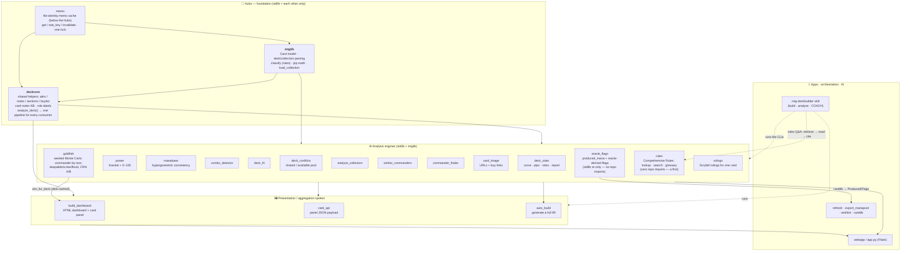

# Codemap — MTG Deckbuilder architecture

How the codebase fits together, and the **hub-and-spoke** model it's being refactored
toward. Companion to [research-roadmap.md](research-roadmap.md) (vision) and
[spec-interactive-analytics-ai.md](spec-interactive-analytics-ai.md) (feature tracker).

## Shape in one line

Two **hubs** (`mtglib` = data, `deckcore` = analysis) — memoized on file identity by
`memo`, which sits below them and imports nothing — feed a ring of stdlib **analysis
engines**, which feed **presentation spokes** (`build_dashboard`, `card_api`,
`auto_build`), consumed by the **Flask web app**, the **CLIs**, and the **coaching skill**.

## Dependency map


```mermaid
flowchart TB
  subgraph HUBS["🎯 Hubs — foundation (stdlib + each other only)"]
    memo["memo<br/>file-identity memo cache (below the hubs)<br/>get / stat_key / invalidate · one lock"]
    mtglib["<b>mtglib</b><br/>Card model · deck/collection parsing<br/>classify (roles) · pip math · load_collection"]
    deckcore["<b>deckcore</b><br/>shared helpers: attrs / notes / sections / buylist<br/>card-notes KB · role labels<br/>analyze_deck() → one pipeline for every consumer"]
  end

  subgraph ENGINES["⚙️ Analysis engines (stdlib + mtglib)"]
    deck_stats["deck_stats<br/>curve · pips · roles · report"]
    power["power<br/>bracket + 0–100"]
    manabase["manabase<br/>hypergeometric consistency"]
    combo["combo_detector"]
    deck_fit["deck_fit"]
    conflicts["deck_conflicts<br/>shared / available pool"]
    analyzec["analyze_collection"]
    simc["similar_commanders"]
    cfind["commander_finder"]
    cimg["card_image<br/>URLs + buy links"]
    oflags["oracle_flags<br/>produced_mana + oracle-derived flags<br/>(stdlib re only — no repo imports)"]
    gold["goldfish<br/>seeded Monte Carlo: commander-by-turn,<br/>keepable/screw/flood, CRN A/B"]
    crules["rules<br/>Comprehensive Rules: lookup · search · glossary<br/>(zero repo imports — a first)"]
    crulings["rulings<br/>Scryfall rulings for one card"]
  end

  subgraph SPOKES["🖼️ Presentation / aggregation spokes"]
    dashboard["build_dashboard<br/>HTML dashboard + card panel"]
    cardapi["card_api<br/>panel JSON payload"]
    autobuild["auto_build<br/>generate a full 99"]
  end

  subgraph APPS["🚀 Apps · orchestration · AI"]
    webapp["webapp / app.py (Flask)"]
    refresh["refresh · export_manapool · wishlist · carddb"]
    skill["mtg-deckbuilder skill<br/>(build · analyze · COACH)"]
  end

  memo --> mtglib
  memo --> deckcore
  mtglib --> deckcore
  mtglib --> ENGINES
  skill -. "rules Q&A: retrieve → read → cite" .-> crules
  oflags -->|"carddb → Produced/Flags"| refresh
  gold -->|"sim_for_deck (disk-cached)"| dashboard
  deckcore --> ENGINES
  deckcore --> SPOKES
  ENGINES --> SPOKES
  ENGINES --> autobuild
  SPOKES --> webapp
  ENGINES --> webapp
  skill -. "runs the CLIs" .-> ENGINES
  skill -. "runs" .-> SPOKES
```

**Rule of the model:** dependencies point *inward/downward* — engines and spokes depend on
the hubs, never the reverse; spokes don't import each other. After **R1** no analysis
module imports the `build_dashboard` renderer (the old circular imports are gone).

## Card knowledge flow — the hub-and-spoke rule for FACTS, not just imports

The dependency rule above is necessary but not sufficient. A second rule governs
*information*: **everything the system knows about a card must flow through the hubs
before any spoke renders it — no engine's knowledge may die inside its own section.**

The rule exists because it was violated, live: Combo Watch told the player *"add
Exquisite Blood (not owned) → drain the whole table"* while the Buy tab — whose entire
job is "what should I spend money on" — had never heard of the card. The combo engine
knew; the buy view didn't. `deckcore.buy_signals()` is the fix and the pattern.

### The facts, where they're computed, and where they must surface

| Fact about a card | Computed by | Must surface in |
|---|---|---|
| owned / qty / spare copies | `mtglib.load_collection` + `deck_conflicts` | decklist badges, panel, add-picker, optimizer tiers |
| identity / legality here | `mtglib` + deck `# Colors:` header | add/replace validation, optimizer candidate filter |
| what it actually taps for / oracle-derived flags | `oracle_flags` → `carddb` → `collection_attrs.csv` → `Card.produced` / `Card.flags` | `deck_stats` colored-source counts (+ `color_sources_basis`), manabase CLI, dashboard pip table, assess packet, `/collection` coverage tile — **each labels the color-identity fallback when `produced is None`** · **`mtglib.classify`** reads the role-bearing flags (`rock`/`dork`/`ramp`, `draw`, `removal`, `wipe`, `counter`) **only where the curated name lists are silent**, so every category count downstream (`deck_stats.categories` → power, dashboard, optimizer role guardrails) inherits them |
| printed creature POWER (how hard the board hits) | `oracle_flags.power_of` → `carddb` → `collection_attrs.csv` `Power` column → `Card.power` | the goldfish **clock** (Phase 2 of `spec-table-ready.md`) — and it only gets there because `deck_stats`'s explicit Card rebuild copies the field; **that list is the ONLY route a Card attribute takes to deck-level analysis**, so anything omitted there is silently invisible to every consumer. Empty cell = "no power / not a creature", absent column = "unknown — the clock says so instead of guessing" |
| fit (color/role/curve/power/theme) | `deck_fit.assess_card` — the Role-need component reads THE archetype-aware template from `deckcore` (ctx["role_ranges"], computed once per deck), and its point spread is CAPPED so (shortage−depth)×2 stays under the optimizer margin: template pressure alone can never buy a swap. Template-vs-field disagreement is printed on the card ("the field plays this one in 4%…"), never resolved silently | panel, add verdict, dead-weight, optimizer `value_of`, the Cuts surface |
| field: inclusion % + synergy | `edhrec` (live → cache → **committed snapshot**) | fit scoring, optimizer, Buy staples, verdicts (with an honest "fit-only" note when absent) |
| combo membership: present / one-away | `combo_detector` (+ `spellbook` beyond `combos.csv`) | Combo Watch, bracket signal, **Buy tab when the piece is unowned** |
| curated buy intent | `.buylist.csv` (player-written) | Buy tab — **always wins dedupe over generated rows** |
| in-decklist-but-unowned | `deck_stats.analyze` → `missing` | BUY badge in decklist **and** the Buy tab |
| how late it actually lands in sequenced play | `goldfish.sim_for_deck` (cast rate + mean first cast vs MV) | dashboard Mana tab, assess page, assess packet — **each printing the screw/flood definitions and the mana-model tier**, since a fallback-tier number is an approximation |
| who decided (player vs tool) | `.changes.csv` `Source` column | NEW badge, advisor scope, optimizer's never-cut set **and never-re-add set** (`deckcore.manual_removals` → `manual_holds`, reported with field evidence — a removal is a decision, not a cooldown) |
| reserved for another deck | `pins.csv` | panel pin toggle, optimizer `reserved`, add-picker warning |
| player's own words | `.notes.md` | Plan tab, optimizer/dead-weight protection |

**The merge points** (hub functions spokes must use, never re-derive):
`deckcore.buy_signals(buylist, combos, missing, idx)` — one Buy list with provenance
(`curated` > `combo` > `decklist`, front-face-aware dedupe) · `deckcore.advise_card()`
— one verdict shape everywhere · `mtglib.name_keys()` — every membership test ·
`deckcore.section_label()` / `mtglib._QTY_RE` — every deck-file parse.

**Closed gaps (were listed here; now wired):** `wishlist.py` (and therefore
`/wishlist` and the ManaPool export, which call it) folds unowned one-away combo
pieces into its Upgrades section via `buy_signals` — curated buylist rows still win;
`spellbook.near_for_deck()` converts CSB one-aways into `combo_detector`'s standard
`near` shape, and the dashboard merges them (piece-set dedupe) into ONE Combo Watch
and ONE Buy view; `edhrec.recommendations()` itself synthesizes from a snapshot, so
`/api/edhrec` staples and the panel's same-slot alternatives work on the server too,
labeled "Snapshot (saved DATE)". **Also closed:** the assess
packet now ends its analytics with ONE merged "CARDS TO BUY" section through
`buy_signals` (provenance-labeled, CSB-merged), and `card_api` carries the REVERSE
combo signal — `completes`: decks where the viewed card is the one missing piece —
rendered by the site-wide panel (so the wishlist's combo rows explain themselves).
**Also closed 2026-08-13:** the dashboard's Buy-tab rows are panel-clickable (both the
buy target and the card it replaces) — they were plain text, which made the cards a Buy
tab exists FOR the only unclickable names on the page.

## Where each signal works — the deployment reality

The app runs in three places; not every data source is reachable from each. **A
signal that must work everywhere has to exist as a committed reference artifact** —
that's why `combos.csv` worked on the hosted server the day the EDHREC field signal
silently vanished there.

**One distinction this table used to blur, at real cost: "CI / sandboxes" is two
different surfaces.** Claude/dev *sandboxes* proxy-block everything (the ❌ column
below). **GitHub-hosted Actions runners have OPEN egress** — they reach Scryfall,
EDHREC, *and* magic.wizards.com. Two workflows prove it: `field-snapshots.yml`
(fetches EDHREC weekly, which is the whole reason it exists) and `recertify.yml`
(runs every network-gated acceptance check on demand). Blurring the two once cost a
whole release cycle: the engine-season spec filed "sandbox blocked" as "must wait
for the player's PC," when a runner could execute the checks all along — and when
one finally did, it caught a live `rules.py` URL-scrape bug (PR #97) the offline
tests could never see. When a check needs the real network, reach for a runner
before parking it on the owner's checklist; only the private collection is
genuinely owner-machine-bound (it never leaves that machine).

| Signal | Player's PC | Hosted server (PythonAnywhere free) | Claude/dev sandboxes |
|---|---|---|---|
| Card images (browser hotlinks) | ✅ | ✅ (phone fetches from Scryfall CDN directly) | n/a |
| `api.scryfall.com` (enrichment) | ✅ | ✅ *(allowlisted — documented public API)* | usually ❌ |
| `json.edhrec.com` (field, live) | ✅ | ❌ **permanently** — free accounts reach only [documented public APIs](https://help.pythonanywhere.com/pages/RequestingAllowlistAdditions/), which EDHREC's internal JSON is not | ❌ |
| Commander Spellbook API | ✅ | likely ✅ (documented API; verify once — degrades to combos.csv-only if not) | ❌ |
| `data/reference/*` (combos, game-changers, **field snapshots**) | ✅ | ✅ via git | ✅ |
| `data/cache/*` (gitignored) | ✅ | only what the server itself fetched | ❌ |
| `data/cache/scryfall/` (verified card text, 30-day TTL — `carddb --verify`) | ✅ | ✅ once fetched | ❌ — every uncached `--verify` is honestly UNVERIFIED |
| `magic.wizards.com` (Comprehensive Rules txt — `rules.py`) | ✅ | ❌ — not a documented public API, same wall as EDHREC | ❌ |
| `api.scryfall.com/cards/named` + rulings (`rulings.py`) | ✅ | ✅ *(same allowlisted API as enrichment)* | ❌ — degrades to a stale cached copy, labeled, or an error payload |

**Field snapshots** close the EDHREC row — and a **GitHub Action** keeps them fresh
with no human in the loop (`.github/workflows/field-snapshots.yml`: weekly cron +
on new decks + a phone-friendly manual button; spec/manual in
[spec-field-snapshot-action.md](spec-field-snapshot-action.md)). Delivery to the
hosted server is also automatic: **`webapp/sync.py`** runs `sync_server.sh` daily
from inside the app (deck edits up, code + snapshots down, reload only if HEAD
moved), with a manual button on the Decks page — spec in
[spec-in-app-sync.md](spec-in-app-sync.md). Manually,
`python3 scripts/edhrec.py --snapshot-all --collection <csv>` on any
EDHREC-reachable machine writes distilled `{inclusion, synergy, names}` maps
to `data/reference/field/<slug>.json` — a few KB per commander, committed like any
reference file. `edhrec.inclusion_map/synergy_map/field_names` fall back to the
snapshot when live + cache both fail, so `deck_fit`, the optimizer, verdicts, and Buy
staples work identically on every surface. Precedence: live/cache first (freshest),
snapshot second, `{}` only when neither exists — and an unreachable fetch never
overwrites a good snapshot. Refresh cadence: whenever decks change meaningfully;
inclusion rates drift slowly (the live cache TTL is a week).

## Module reference (`scripts/`, stdlib-only Python 3)

| Module | Role | Depends on |
|---|---|---|
| memo | Below-the-hubs memo cache: `get(key_parts, build)` keyed on `stat_key()` file identity (`(path, mtime_ns, size)`, `(path, None)` for missing), `invalidate(substr)`, `MAX_ENTRIES` oldest-first eviction, one `threading.Lock`. Backs `mtglib.load_collection` (keyed on ALL merged inputs, not just the CSV) and `deckcore.analyze_deck` (deck + companions + collection + a reference-directory fingerprint). **Cached values are shared and must be treated as frozen** — `tests/test_memo.py` fingerprints the cached objects across every consumer to prove nothing scribbles on them. Unfingerprintable inputs (a preloaded collection list, caller-supplied `refs`) bypass the cache rather than risk a stale answer | — (`os`, `threading`; imports nothing in-repo, so the hubs can import it) |
| **mtglib** | Data hub: `Card`, parsing, `classify` (curated lists → `Card.flags` → types, in that precedence), pip math, `load_collection` (+ attrs/additions overlay, **memoized on every file it merges** — `collection_inputs()` IS that key); reads all major collection-app CSV formats via header aliases (`docs/collection-formats.md`) | memo |
| **deckcore** | Analysis hub: shared file loaders, card-notes KB, role labels; *(R2)* `analyze_deck()`; `advise_card()` (per-card verdict), `manual_adds()` / **`manual_removals()`** (Source=manual-* — the add side protects from cuts, the removal side blocks re-adds), `buy_signals()` (the merged Buy view), `section_label()`/`real_section_labels()`; **THE role template** (`ROLE_RANGE` + archetype table + `role_ranges*` + `LAND_RANGE` + `archetype_words` — one table every consumer reads; five disagreeing copies existed) | mtglib |
| deck_stats | curve, colored-pip demand vs sources, role counts, ownership | mtglib |
| power | WotC bracket (1–5, estimated) + 0–100 power score. Reads the deck's optional **`# Bracket:`** header (`read_declared_bracket` / `with_declared`): the player's setting headlines, `bracket` keeps meaning DETECTED, and the reasons never disappear | mtglib, deck_stats, combo_detector, deckcore |
| manabase | hypergeometric consistency: keepable %, source adequacy vs Karsten, risky-on-curve. Ships an `explain` dict beside the numbers (what / why / what healthy looks like) so the CLI, dashboard and app render ONE wording and the caveats sit with the stat they qualify | mtglib |
| combo_detector | infinite / 2-card combos present or one-away (`combos.csv`) | mtglib |
| deck_fit | per-card fit score + `dead_weight()` (below-deck-median passengers) + **`card_value()`** (the ONE scorer both sides of an optimizer swap and the Cuts surface use) + `cut_ranking()` ("if you must cut", advisory, protected cards shown flagged not hidden) (library; no CLI) | mtglib |
| deck_conflicts | shared-across-decks + `--available` buildable pool | mtglib |
| analyze_collection | "what can I build?" pool stats by color/type/tribe | mtglib |
| similar_commanders / commander_finder | alternate commanders / "build next" ranking | mtglib, deckcore/simc |
| card_image | Scryfall image URLs + `purchase_links` (TCGplayer/ManaPool/Card Kingdom) | mtglib |
| oracle_flags | Face-aware derivation from a Scryfall card object: `produced_of()` (what it actually taps for) + `derive_flags()` (v1: `etb-tapped`/`-cond`, `rock`, `dork`, `ramp`, `draw`, `mana2`/`mana3`, `removal`, `wipe`, `counter`; **v2 (2026-08-14, `spec-mana-intelligence.md`): `fetch:land`/`fetch:basic`/`fetch:<type>`/`fetch:basic-<type>` — what a library search can FIND, read from the clause so Demonic Tutor stays silent and Farseek finally registers — plus `mana-restricted`** for "spend this mana only" lands Scryfall reports as full rainbow sources). `VOCAB_VERSION` rides every attrs row as `FlagsVer`; flags and their version are one write. v2 tokens map to NO classify() role on purpose. Pure dict-in/set-out, no I/O; heuristic by construction, so curated lists and human verification win | — (`re` only; no repo imports) |
| rules | The **Comprehensive Rules**, retrieved rather than recalled: downloads WotC's official txt once into `data/cache/rules/` (never committed — ~1 MB of copyrighted text revving 5-6×/year), parses it into rules / sections / chapters / glossary in document order, and answers three questions — `lookup()` by number (with subrules and section/chapter context), `search()` (bag-of-words: +2/term, +5 all terms, +10 exact phrase, ties by document order), `glossary_lookup()` (exact → prefix → substring, with the rule refs the definition points at). Manual refresh only (`--refresh`); any cached copy is used and labeled `fetched <date>` from its mtime. Never raises — every failure is the standard error payload plus manual-download instructions | **nothing — the first engine here with zero repo imports.** Every other engine imports `mtglib`; rule text contains no card names, so there is nothing to normalize |
| rulings | Scryfall **rulings for one named card** — the official clarifications behind an interaction. `/cards/named?fuzzy=` → the card's `rulings_uri` (0.1s courtesy delay, `has_more` followed), cached 30 days in `data/cache/rulings/`. On a failure the cache is consulted **regardless of age** (stale-and-labeled beats a shrug) before the error payload. Always carries `requested` alongside the resolved `name`: a fuzzy match can confidently resolve to the wrong card, and the caller must confirm | mtglib (`front_face`/`_norm` for the cache key — the `' // '` trap) |
| goldfish | Seeded goldfish Monte Carlo (+ the **CLOCK**: median turn the deck presents lethal, mapped onto the brackets' own turn anchors — combat-only, labelled UNDERSTATED for drain decks, no clock without printed power; and `--disruption standard`, an EXPERIMENT facing phantom opponents on a SECOND RNG stream so CRN pairing survives): commander-by-turn, keepable/screw/flood (definitions shipped as data), mean lands by turn, sequenced first-cast per card, CRN A/B swap deltas. `sim_for_deck()` is the ONE cached entry point every surface calls (`data/cache/goldfish/`). Two mana tiers — enriched `Card.produced`/`Card.flags`, else a **labelled** color-identity fallback. Answers the sequenced-play questions `manabase`'s exact-but-unconditional closed forms structurally cannot | mtglib (`deck_stats`/`deckcore` imported inside the loader only) |
| **build_dashboard** | Spoke: deck → self-contained HTML dashboard + card panel | mtglib, deckcore, deck_stats, power, manabase, combo_detector, deck_fit, simc, card_image, deck_conflicts, goldfish |
| **card_api** | Spoke: grounded per-card JSON for the site-wide panel | mtglib, deckcore, card_image, combo_detector |
| **auto_build** | Spoke: assemble a full 99 from the owned pool (emits EDHREC-style type sections via `deckcore.type_bucket`; role sections only for cards with no type data) | mtglib, deck_fit, deck_conflicts, simc, power, deck_stats, manabase, combo_detector, card_image |
| **deck_sections** | Spoke: regroup a deck file into the EDHREC-style type-section convention (Creatures/Instants/…/Lands/Basics, commander first) from the same data stack every tool uses; unknown types fall back to old-section hints, then an explicit `Unsorted` section — never a guess. Merges duplicate same-name BASIC lines (a nonbasic twin is left visible to `singleton_violations` instead). Idempotent; `--all --apply` migrates every deck. `has_unsorted()` / `has_section_comments()` are the filters `webapp/sync.py` uses to auto-regroup after a sync without eating hand-written prose | mtglib, deckcore |
| carddb | **Two modes.** *Enrich* the collection (colors/types/MV/**subtypes**/**produced mana + oracle flags**/exact-printing id) → `collection_attrs.csv`; **default: Scryfall `/cards/collection` API** (no download), `--bulk`/`--download-bulk` for offline. Subtypes power tribal detection (deck_fit / auto_build); `Produced`/`Flags` (via `oracle_flags`) power actual-production source counts. *Verify* named cards — **`--verify "<name>"`** (repeatable, `--json`) batches names through the same endpoint, reconciles **positionally** (a back-face request returns a card named `Front // Back`, so name-keyed matching misfiles it), retries each miss once via `/cards/named?fuzzy=`, and returns verbatim oracle text + commander legality or an honest `UNVERIFIED`. 30-day cache in `data/cache/scryfall/`; a hallucinated card name dies here. The two modes are exclusive (enrichment still requires `--collection`). | mtglib, oracle_flags |
| edhrec | EDHREC community staples for a commander vs your collection (inclusion% → own=add / missing=buy) + `inclusion_map()`/`synergy_map()`, the **field signal** behind `deck_fit`. Three-tier sourcing: live fetch → disk cache → **committed snapshot** (`data/reference/field/`, written by `--snapshot-all` on a machine that can reach EDHREC); degrades gracefully | mtglib |
| gen_card_notes | Draft grounded card notes from oracle + role + EDHREC into `card_notes.generated.csv` (curated `card_notes.csv` always wins) | mtglib, deckcore, deck_fit |
| **optimize** | Tune an EXISTING deck toward what the field plays: swaps low-value cards for owned+free high-inclusion ones, upgrades weak lands, repairs basics, keeps 100 cards + role balance. `--all --apply`. The role template is **archetype-aware** (`role_ranges` reads the deck's `# Archetype:` header — a control deck's 15 counterspells are correct, not nine over budget; unmatched words are reported, never silently ignored) and the **field has a veto over role repair**: a swap may never cut a card the field plays MORE than the incoming one, because template pressure arrives through `value_of`'s fit blend and can manufacture the 25-point margin on its own | mtglib, deckcore, deck_fit, deck_conflicts, power |
| spellbook | Commander Spellbook combos present / one-away in a deck (full CSB DB, beyond `combos.csv`); disk-cached, degrades gracefully — and **degrades cheaply**: a failure is remembered for `FAIL_TTL` (5 min) so an unreachable CSB costs one attempt per cooldown instead of one per deck-page view (it was 315 ms of every warm render, ceiling 25 s when a connection hangs). The remembered failure is never served AS data — callers still get the empty error payload they already label | mtglib |
| wishlist / staples_crossref / export_manapool / refresh | buy list / staple diff / exports / regenerate-all | mtglib (+ deck_conflicts / wishlist) |

## Web app (`webapp/`)

`app.py` (Flask) is the primary spoke consumer: routes call the engines/spokes and render
Jinja templates. Shared front-end: `static/cardpanel.{css,js}` (the bottom-sheet card panel,
site-wide via `data-card`), `static/cardgrid.js` + `static/collection.js` (batch CDN image
loading — see **[card-images.md](card-images.md)** for the retrieval rules). The **saved-deck dashboard is editable** (`generate(..., editable=True)`): the card panel
gets Remove / Replace (from the alternatives or an owned-card search), `POST /deck/<stem>/card`
rewrites the deck `.txt` in place, and shared-across-decks status shows in the panel. CLI-rendered
dashboards keep `editable=False`. Key routes: `/` decks leaderboard · `/deck/<stem>` dashboard (six subtabs; ＋ Add card)
· `/deck/<stem>/card` (remove/replace, front-face duplicate guard) · `/deck/<stem>/add`
(validated add + fit verdict) · `/api/deck/<stem>/advise` · `/api/deck/<stem>/sections`
· `/api/collection/search` (owned autocomplete) · `/build-next` (+ `/…/deck` auto-build,
"build any commander") · `/collection` (searchable grid) · `/wishlist` · `/shared`
· `/api/card/<name>` · `/deck/<stem>/assess.txt` (coaching packet)
· **`/deck/<stem>/table-card`** (the Rule-0 screen: bracket, Game Changers, MLD/extra
turns/combos, clock, game plan — phone and print) · **`/deck/<stem>/mulligan`** +
`/api/deck/<stem>/hand` (keep/ship practice on the deck's real hands, verdict from
`goldfish.keep_verdict`) · **`/pins`** + `/pins/move` (every reserved copy, one-tap
move) · `/deck/<stem>/bracket` (the player's bracket setting)
· `/api/deck/<stem>/ab` (paired swap preview behind shift-click in the card panel —
**disk-cached** by `goldfish.ab_for_deck`, so the second look at a swap is a file read).

**Background work — two modules, one pattern.** `sync.py` (daily git sync) and
`enrich_bg.py` (collection enrichment after an upload) both use: a daemon thread, a
JSON status file under `data/cache/`, an already-running guard, and a **stale-status
honesty rule** — PythonAnywhere kills daemon threads on app reload, so a `running`
entry past its TTL renders as *interrupted*, never as a spinner that never stops.
Copy that pattern rather than inventing a third. `/collection/upload` returns
immediately and the attrs file is written atomically inside `carddb`
(`write_attrs_csv`: tmp + `os.replace`), so a page render during a minutes-long
enrichment sees the old complete file or the new one — never half of one.

## The coaching skill (`.claude/skills/mtg-deckbuilder/`)

`SKILL.md` (persona + build/analyze/**coach** workflows) + `references/` (grounding-rules,
deckbuilding-principles, rules-reference, tooling-and-data, **coaching**). It *invokes the
CLIs* to stay grounded; it doesn't reimplement them. Runs in Claude Code (no app-side API).

**Rules questions are retrieved, not recalled.** `references/rules-reference.md` leads with
"Ask the CR, don't recall it": `rules.py` for the Comprehensive Rules, `rulings.py` for a
card's official clarifications, `carddb.py --verify` for its verbatim text — retrieve, then
**read**, then cite a rule number that came out of the retrieved text. The five corrections
that file used to open with are now framed as *known traps*, not an index. Because
wizards.com is reachable from the player's PC only, a degraded run must say the answer is
**uncited** rather than quietly falling back to memory; that honesty line, plus the absence
of any `/api/rules` route, is the whole story of where this layer runs.

**Subagents (`.claude/agents/`)** — two, one per shape of transcript bloat. They run the
same CLIs and return **conclusions**, so the numbers are byte-identical; only the context
cost changes.

| Agent | Delegated when | Runs | Returns |
|---|---|---|---|
| `card-verifier` | more than ~3 cards need verifying (esp. post-2025 sets) | one batched `carddb.py --verify` | a table (canonical name / cost / type / identity / commander-legal / **verbatim** text) + one `UNVERIFIED:` line |
| `collection-auditor` | any full-pool scan — "what can I build", "how many X do I own", "which decks share cards", "rank my decks" | `analyze_collection`, `deck_conflicts [--available]`, `power --rank`, `commander_finder`, `edhrec` | verdict first, then findings — each with its count and the exact producing command |

Both are `tools: Bash, Read` (read-only, no web tools — the verifier answers from the
Scryfall CLI, never a search dump) and both **Read `references/grounding-rules.md` first**
rather than carrying a copy that drifts. The main session keeps the persona, every verdict,
deck assembly and the optimize decisions. `tests/test_agents.py` pins the structure;
SKILL.md's "Delegate the heavy work" section is the deterministic path, since automatic
delegation is probabilistic. Where the Agent tool doesn't exist, the skill does the same
work inline — the workflow is unchanged, the transcript is longer.

## Data (`data/`)

`collection/` (name-only `collection_snapshot.txt` committed; private `collection.csv` +
derived `collection_attrs.csv` gitignored) · `decks/*.txt` (+ optional
`.attrs/.notes/.buylist/.changes` companions) · `reference/` (game_changers, tutors,
combos, card_notes, role_staples, commanders, archetype_support, **field/** — committed
EDHREC snapshots, one per commander).

## Keeping decks optimized (automated at four points)

| When | What runs | Where |
|---|---|---|
| **A new deck is saved** ("Save to my decks") | optimize runs automatically | `webapp` `build_deck_save` |
| **On demand** | ⚡ Optimize button per deck | `POST /deck/<stem>/optimize` |
| **After buying cards** | `refresh.py --optimize` (then rebuilds dashboards) | CLI |
| **Any Claude-driven build** | workflow step 5 in `SKILL.md` | the skill |

**Deliberately NOT automatic: manual edits.** The card panel's Remove/Replace and the deck
editor save your choice as-is — the optimizer never second-guesses a deliberate swap. Use
the ⚡ button when you *want* a tune-up. It's idempotent: an already-tuned deck is untouched.

```bash
python3 scripts/optimize.py --all --collection data/collection/collection.csv          # dry run
python3 scripts/optimize.py --all --collection data/collection/collection.csv --apply  # write
python3 scripts/refresh.py  --optimize --collection data/collection/collection.csv     # tune + rebuild
```

**The signal:** `deck_fit` scores cards by **EDHREC inclusion % AND synergy for that
specific commander** (`edhrec.inclusion_map` / `synergy_map`). Inclusion says *popular*;
synergy says *specifically wanted here* — Command Tower is 93% inclusion but ~5 synergy
(generic), while Dragon Tempest is 77%/69 (a Dragon payoff). Rewarding synergy promotes a
commander's signature cards over cards that are merely widely played. Without it the scorer only saw generic quality, so a
vanilla 1-drop outranked a 95%-played auto-include on curve alone — that's why the first
auto-built decks scored 12–24% against the field while hand-built ones scored 56–80%.

**Availability tiers.** Incoming cards rank **free** (you own a spare) > **shared** (owned
but committed to another deck) > **buy** (not owned, ≥55% inclusion). Sharing is **on by
default** — two decks in one archetype legitimately want the same cards, and you decide
which gets the physical copy when you sleeve. Buys are considered by default but **never
enter the 99** (2026-08-11, player request: decks are built from owned cards only): each
pairs with an in-deck card and is appended to `<deck>.buylist.csv` with `Replaces` = that
card, so the buylist always answers "when this arrives, which card do I pull". Use
`--owned-only` for a list buildable from spare copies today, or `--no-buys` to skip the
buylist recommendations too.

**What changed.** Each applying run appends to `<deck>.changes.csv` (`Card,Added,Replaced,
Source`), and the dashboard badges anything added in the last **14 days** with a gold `NEW`
tag (tooltip: when, and what it replaced). Without it a collection refresh can swap a dozen
cards into a 100-card list and leave you to spot them by eye. `deckcore.load_changes()`.

**Pool report.** Every run prints how the commander's top-25 splits into in-deck / free /
committed-elsewhere / not-owned, naming the decks holding contested copies — so a deck that
*can't* improve reads as "pool exhausted", not "badly built". `write_buylist()` turns the
unowned gaps into `<deck>.buylist.csv` (never overwriting a hand-written one).

**Guardrails** (each exists because a naive pass got it wrong): both sides of a swap are
scored by ONE `value_of()` = `max(field %, (fit−60)×2)` — adds are queued by it and the
≥25-point margin compares value to value (the old raw-inclusion queue let a 93% generic
beat a high-synergy archetype payoff twice); the commander, basics, `card_notes.csv`
entries, anything named in the deck's `.notes.md`, and every `Source=manual-*` card are
never cut; role counts must stay in template range; lands only swap for lands; every
membership test goes through `mtglib.name_keys()` (front-face aware) and
`singleton_violations` aggregates by front-face key; and with no field data the manabase
is left alone entirely. Validate with EDHREC top-25 overlap before/after — see
`docs/handoff.md`.

## Design system (one visual language, two surfaces)

`scripts/assets/tokens.css` is the **single source of truth** for the type scale (1.25
modular), 4px spacing scale, radii and elevation. It deliberately contains **no colours and
no fonts** — those are the only things a surface may legitimately differ on.

| Surface | Gets tokens by | Supplies its own |
|---|---|---|
| Flask web app | `<link>` to `/static/tokens.css` (served from `scripts/assets/`) | `webapp/static/app.css` — one dark theme + app components |
| Generated dashboard | **inlined** at render time, so the file stays self-contained/offline | one of five `THEMES` (default / yshtola / cloud / rakdos / spider) |

Both surfaces previously drifted: the app had 14 ad-hoc font sizes and the dashboard 18
more, plus 38 and 29 spacing values respectively. `tests/test_design_tokens.py` is the
guard — it fails if `app.css` redefines a scale token, if `tokens.css` starts hardcoding a
colour, if any theme stops inlining the tokens, or if the same token resolves to different
values on the two surfaces.

## Tests (`tests/`, pytest)

```bash
pip install -r requirements-dev.txt && pytest
```

Offline and hermetic — every deck/collection a test touches is written into pytest's
`tmp_path`, so the suite never reads or writes the player's real `data/`. Coverage is aimed
at the code that can *destroy data or lie*: `test_deck_edit.py` (the web app rewriting deck
files in place — quantity/section preservation, no-op safety, comment lines, first-match-only),
`test_mtglib.py` (parsing / `_norm` / classification), `test_manabase.py` (hypergeometric
values + monotonicity), `test_auto_build.py` (exactly 100 cards, color legality, singleton,
honest shortfall, the `scan(skip=)` self-exclusion regression), and `test_dashboard.py`
(self-contained HTML, card panel present, editable-only-in-app, batch image loader) — which
doubles as the safety net for refactoring `build_dashboard`. The enrichment contract has its
own three: `test_oracle_flags.py` (the flag vocabulary, dict fixtures only),
`test_carddb.py` (the pinned 9-column header + write→overlay round trip, Scryfall
monkeypatched) and `test_color_sources.py` (produced-vs-identity counting and the honesty
label on every surface). The simulator has `test_goldfish.py`: convergence against
`manabase`'s exact hypergeometrics (±2pp at 4,000 games — if the two engines disagree on
what they *both* know, nothing they disagree about is credible), seeded determinism, the
A/A-exact-zero tripwire for common-random-numbers pairing, degenerate decks, and cache
invalidation. The verification path has `test_carddb_verify.py` (the positional batch
reconciliation a back-face request breaks by name, the one fuzzy retry, the True/False/
**None** legality tri-state, and UNVERIFIED-not-invented when Scryfall is unreachable). The
rules layer has `test_rules.py` — a module-level `SAMPLE_CR` replicating the official
layout *including its duplicated Contents headings*, because slicing the body on the first
"Glossary" (the one in the Contents listing) yields a parsed-looking file with zero rules
in it; plus the cp1252 round-trip, the no-TTL stale-cache date label, and the
blocked-network degrade — and `test_rulings.py` (fuzzy resolution surfaced, stale-okay
cache, `has_more` pagination, and that a `//` name is never naively split). Then
`test_agents.py` — six structural invariants over `.claude/agents/`, since a subagent
prompt is the one artifact here that nothing else in CI executes. CI: `.github/workflows/tests.yml`
runs pytest on 3.11/3.13 and re-checks that `scripts/` still imports with **no third-party
packages installed**.

## Refactor status (hub-and-spoke)

- **R1 ✅ done** — extract shared helpers into `deckcore`; break the `build_dashboard`
  circular imports. Behavior-identical (UAT harness byte-for-byte).
- **R2 ✅ done** — `deckcore.analyze_deck()` / `analyze_cards()`; `build_dashboard.generate`,
  the webapp assess packet, and `auto_build` now call one pipeline (`power.build_for_deck` +
  the `manabase` CLI stay as the low-level primitives). Behavior-identical (UAT byte-for-byte).
- **R3 ✅ done** — the dashboard's front-end assets moved out of the Python into
  **`scripts/assets/`**: `card_panel.html` (panel markup + its JS), `card_panel.css`
  (real CSS; `__DISPLAY__/__HEAD__/__MONO__` are swapped for the theme's fonts), and
  `card_images.html` (the batch image loader). `_asset()` reads + caches them and they're
  **inlined at render time**, so a generated dashboard is still one self-contained file.
  `build_dashboard.py` 1,411 → 1,018 lines; the 285-line `card_modal_block` string is gone,
  and the panel's JS/CSS are now editable (and lintable) without Python string-escaping.
  Verified **byte-identical** across all 6 decks × editable/non-editable (12/12).

## Shipped from the backlog

- ✅ **Enrichment via Scryfall `/cards/collection` API** — now `carddb.py`'s **default**
  (no ~40 MB download). Resolves each owned card by exact printing (`set`+`collector_number`,
  or a Scryfall id) with a name fallback; ~1 request per 75 cards, stdlib-only; bulk kept as
  the `--bulk`/`--download-bulk` offline path. Verified 2040/2040 on the real collection.
- ✅ **Auto-enrich on collection upload** — `/collection/upload` saves to the private,
  gitignored `collection.csv` (never the tracked snapshot) and runs `carddb.enrich_api` inline,
  so a fresh export lights up colors/types/curve/manabase with zero manual step. This also
  closed a privacy bug: uploads used to overwrite the committed name-only snapshot.
- ✅ **EDHREC staples on the build view** — `scripts/edhrec.py` fetches a commander's community
  staples (json.edhrec.com), computes inclusion % (num_decks/potential_decks) and splits them
  into owned (add) vs missing (buy) against your collection. Shown on the Build Next deck page
  (`/api/edhrec/<commander>`), cards clickable → panel. Disk-cached (`data/cache/`), stdlib-only.
- ✅ **Card "Strategy" blurb (Phase 4)** — `card_api._strategy` role/type scaffold + oracle-derived
  mechanic tags in `cardpanel.js`; never blank (Scryfall type-line fallback for non-owned cards).
- ✅ **Commander Spellbook combos** — `scripts/spellbook.py` (find-my-combos API, disk-cached)
  surfaces every combo present + one-card-away in a deck, beyond `combos.csv`. Wired into the
  coaching **assess packet** and an async section on the Build Next view (`/api/combos/build/<cmd>`).

## Parked ideas / backlog

- EDHREC (`pyedhrec`) staple/inclusion chip + buy-to-complete · Commander Spellbook combos ·
  Phase 4 generated card strategies. See the feature tracker.
